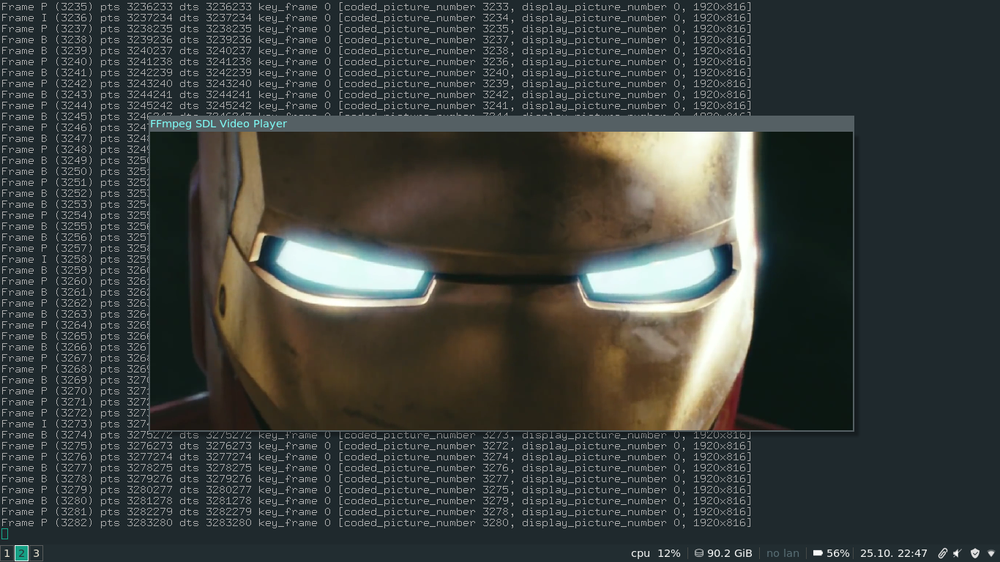

# Tutorial 01: Making Screencaps


Movie files have a few basic components. First, the file itself is called a
container, and the type of container determines where the information in the
file goes. A container or wrapper format is a metafile format whose
specification describes how different elements of data and metadata coexist in a
computer file. A video file format is a type of file format for storing digital
video data on a computer system. Video is almost always stored in compressed
form to reduce the file size.
A video file normally consists of a container (e.g. in the Matroska format)
containing video data in a video coding format (e.g. VP9) alongside audio data
in an audio coding format (e.g. Opus). The container can also contain
synchronization information, subtitles, and metadata such as title. A
standardized (or in some cases de facto standard) video file type such as .webm
is a profile specified by a restriction on which container format and which
video and audio compression formats are allowed. Examples of containers are AVI
and Quicktime.

Next, you have a bunch of streams; for example, you usually have an audio stream
and a video stream. (A "stream" is just a fancy word for "a succession of data
elements made available over time".)

The data elements in a stream are called frames. Each stream is encoded by a
different kind of codec. In filmmaking, video production, animation, and related
fields, a frame is one of the many still images which compose the complete
moving picture. The term is derived from the fact that, from the beginning of
modern filmmaking toward the end of the 20th century, and in many places still
up to the present, the single images have been recorded on a strip of
photographic film that quickly increased in length, historically; each image on
such a strip looks rather like a framed picture when examined individually.
The term may also be used more generally as a noun or verb to refer to the edges
of the image as seen in a camera viewfinder or projected on a screen. Thus, the
camera operator can be said to keep a car in frame by panning with it as it
speeds past.

The codec defines how the actual data is COded and DECoded - hence the name
CODEC. A video codec is an electronic circuit or software that compresses or
decompresses digital video. It converts uncompressed video to a compressed
format or vice versa. In the context of video compression, "codec" is a
concatenation of "encoder" and "decoder"—a device that only compresses is
typically called an encoder, and one that only decompresses is a decoder.
The compressed data format usually conforms to a standard video compression
specification. The compression is typically lossy, meaning that the compressed
video lacks some information present in the original video. A consequence of
this is that decompressed video has lower quality than the original,
uncompressed video because there is insufficient information to accurately
reconstruct the original video.
There are complex relationships between the video quality, the amount of data
used to represent the video (determined by the bit rate), the complexity of the
encoding and decoding algorithms, sensitivity to data losses and errors, ease of
editing, random access, and end-to-end delay (latency).
Examples of codecs are DivX and MP3.

Packets are then read from the stream. Packets are pieces of data that can
contain bits of data that are decoded into raw frames that we can finally
manipulate for our application.

For our purposes, each packet contains complete frames, or multiple frames in
the case of audio.

At its very basic level, dealing with video and audio streams is very easy:

```shell
10 OPEN video_stream FROM video.avi
20 READ packet FROM video_stream INTO frame
30 IF frame NOT COMPLETE GOTO 20
40 DO SOMETHING WITH frame
50 GOTO 20
```

Handling multimedia with ffmpeg is pretty much as simple as this program,
although some programs might have a very complex "DO SOMETHING" step. So in this
tutorial, we're going to open a file, read from the video stream inside it, and
our DO SOMETHING is going to be writing the frame to a PPM file.

This repo contains an updated and reviewed version of the original
["An ffmpeg and SDL Tutorial or How to Write a Video Player in Less Than 1000 Lines"](http://dranger.com/ffmpeg/).

--

##### Originally seen at: http://dranger.com/ffmpeg/tutorial01.html
##### This repo contains both the original (deprecated) and updated implementations for each tutorial.
##### The source codes originally written by Martin Bohme are also provided for ease of access.

--

Rambod Rahmani <<rambodrahmani@autistici.org>>

